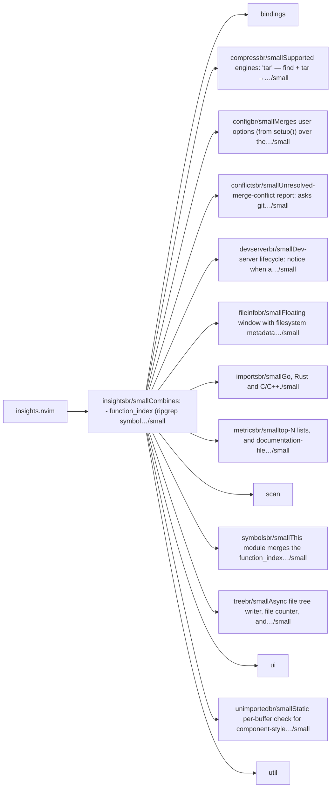
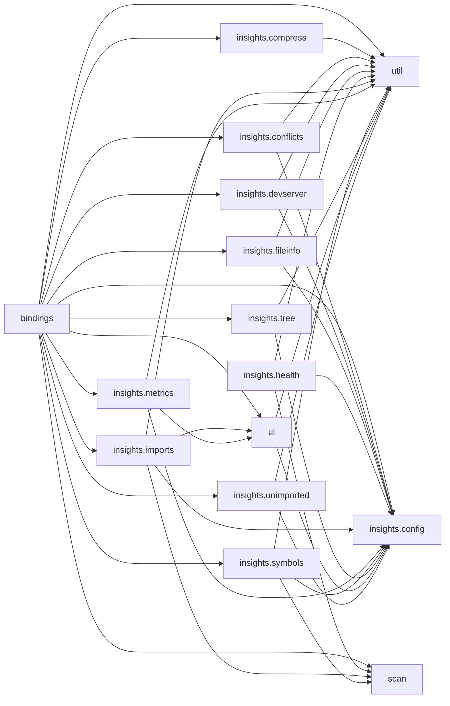

# insights.nvim — module map

> **Generated** by `documentation`. Do not edit by hand — run `:DocMap`
> (or `nvim --headless -l scripts/gen_map.lua`) to regenerate.

**12 modules** · 5 namespaces · 32 helper files

The [interactive map](index.html) has filtering, full descriptions and
source links; this page is the version the code host renders directly.

## Namespaces

## Dependencies

Which parts of the tree require which, rolled up to the second level.
The [interactive map](index.html)'s **Deps** view has this per module,
in both directions, with load-time and lazy requires told apart.

## Modules

| Module | Description | Fns | Docs |
|---|---|---|---|
| `insights` | Combines: - function_index (ripgrep symbol indexer, multi-language) - gather (Tree-sitter Lua symbol scanner) - lua_project_file_stats (Lua code metrics) -… | 11 | [src](../../lua/insights/init.lua) |
| &nbsp;&nbsp;`bindings` |  |  |  |
| &nbsp;&nbsp;`insights.compress` | Supported engines: "tar" — find + tar → .tar.gz (Unix/macOS) "zip" — find + zip → .zip (Unix/macOS, requires zip) "powershell" — Compress-Archive… | 5 | [src](../../lua/insights/compress/init.lua) |
| &nbsp;&nbsp;`insights.config` | Merges user options (from setup()) over the plugin's defaults. | 3 | [src](../../lua/insights/config/init.lua) |
| &nbsp;&nbsp;`insights.conflicts` | Unresolved-merge-conflict report: asks git for files in the "unmerged" state and puts them in the quickfix list. | 4 | [src](../../lua/insights/conflicts/init.lua) |
| &nbsp;&nbsp;`insights.devserver` | Dev-server lifecycle: notice when a terminal Neovim owns starts a dev server, ask once whether it should be killed when Neovim exits, and honour the answer on… | 9 | [src](../../lua/insights/devserver/init.lua) |
| &nbsp;&nbsp;`insights.fileinfo` | Floating window with filesystem metadata for the current buffer. | 5 | [src](../../lua/insights/fileinfo/init.lua) |
| &nbsp;&nbsp;`insights.imports` | Go, Rust and C/C++. | 27 | [src](../../lua/insights/imports/init.lua) |
| &nbsp;&nbsp;&nbsp;&nbsp;`insights.imports.langs` | Every entry implements the shared `ImportLang` contract: id, label, extensions, rg_prefilter, scan_source(src) -> RawImport[] (regex/text scan of a whole… |  | [src](../../lua/insights/imports/langs/init.lua) |
| &nbsp;&nbsp;`insights.metrics` | top-N lists, and documentation-file (Markdown/TXT/JSON) analysis. | 11 | [src](../../lua/insights/metrics/init.lua) |
| &nbsp;&nbsp;`scan` |  |  |  |
| &nbsp;&nbsp;`insights.symbols` | This module merges the function_index (ripgrep) and gather (Tree-sitter) sources. | 6 | [src](../../lua/insights/symbols/init.lua) |
| &nbsp;&nbsp;`insights.tree` | Async file tree writer, file counter, and clipboard copy. | 7 | [src](../../lua/insights/tree/init.lua) |
| &nbsp;&nbsp;`ui` |  |  |  |
| &nbsp;&nbsp;`insights.unimported` | Static per-buffer check for component-style tags that are used but never imported or defined. | 5 | [src](../../lua/insights/unimported/init.lua) |
| &nbsp;&nbsp;`util` |  |  |  |

## Drift

0 errors · 0 warnings · 17 info

No errors or warnings.

17 informational findings

| Check | Message |
|---|---|
| `dead-function` | engines.powershell is marked @internal and nothing in the tree calls it |
| `dead-function` | engines.tar is marked @internal and nothing in the tree calls it |
| `dead-function` | engines.zip is marked @internal and nothing in the tree calls it |
| `missing-readme` | lua/insights has no README.md |
| `missing-readme` | lua/insights/compress has no README.md |
| `missing-readme` | lua/insights/config has no README.md |
| `missing-readme` | lua/insights/conflicts has no README.md |
| `missing-readme` | lua/insights/devserver has no README.md |
| `missing-readme` | lua/insights/fileinfo has no README.md |
| `missing-readme` | lua/insights/imports has no README.md |
| `missing-readme` | lua/insights/imports/langs has no README.md |
| `missing-readme` | lua/insights/metrics has no README.md |
| `missing-readme` | lua/insights/symbols has no README.md |
| `missing-readme` | lua/insights/tree has no README.md |
| `missing-readme` | lua/insights/unimported has no README.md |
| `unreferenced-module` | insights is required by no other file in the tree |
| `unreferenced-module` | insights.health is required by no other file in the tree |

